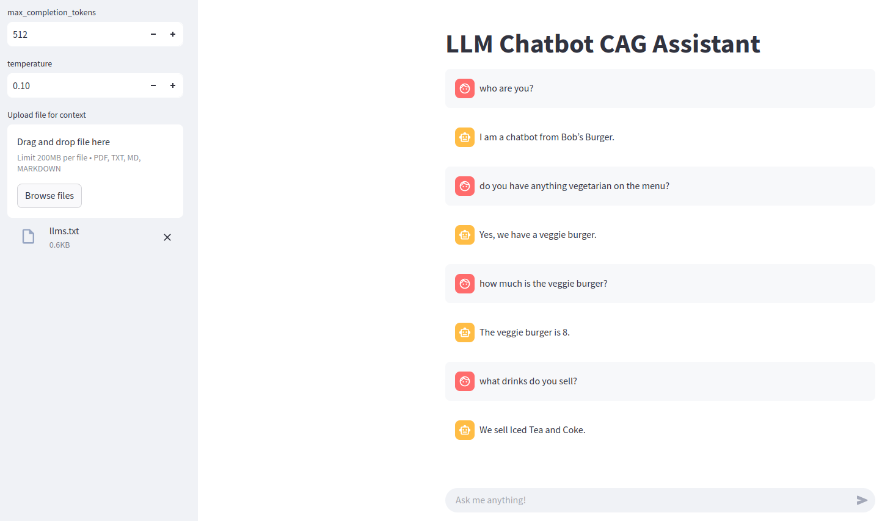

# llm-chatbot-cag
A local LLM chatbot with CAG / Context Caching for PDF input files



Install dependencies with `pip install -r requirements.txt`

Run with `streamlit run src/app.py`

## vLLM
Start the vLLM OpenAI-compatible server with automatic prefix caching with

```bash
vllm serve MODEL_NAME --api-key token-abc123 --enable-prefix-caching
```


Or use Docker:

```bash
docker run --runtime nvidia --gpus all \
    -v ~/.cache/huggingface:/root/.cache/huggingface \
    --env "HUGGING_FACE_HUB_TOKEN=<secret>" \
    -p 8000:8000 \
    --ipc=host \
    vllm/vllm-openai:latest \
    --model MODEL_NAME \
    --api-key token-abc123 \
    --enable-prefix-caching
```
You need a CUDA compatible GPU for this.