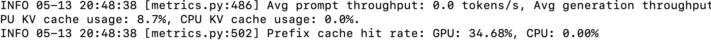

# vLLM Setup and CAG(Cache Augmented Generation) Chatbot on MacBook Pro (CPU-Only)

## Additional details about this POC is provided in this [blog](https://medium.com/@ahilanp/cache-augmented-generation-cag-a-simpler-more-efficient-alternative-to-rag-for-enterprise-fd911ed66aad). ##
This proof-of-concept (POC) demonstrates how to run the **microsoft/Phi-3-mini-128k-instruct model** on a MacBook Pro using **CPU with vLLM and Streamlit**. It sets up a local OpenAI-compatible API server and integrates a chatbot that supports long-context document Q&A via **Cache Augmented Generation (CAG)**. The guide includes step-by-step instructions for setup, document upload, and interactive querying from the uploaded file.

vLLM's Automatic Prefix Caching (APC) is a key performance feature that **detects and reuses repeated prompt prefixes by caching their key-value (KV) representations**. When **--enable-prefix-caching** is set, vLLM automatically identifies identical prefixes—such as a static document in a prompt—and **avoids recomputing** them, greatly improving response speed and efficiency. To benefit from this, the full document or context must be included in every prompt so that the prefix exactly matches and the cache can be reused. This is crucial in Cache-Augmented Generation (CAG) setups, where the document acts as a static knowledge base. **If the flag is not enabled, vLLM will recompute the entire prompt from scratch every time, leading to slower and less efficient responses**. Prefix caching is stateless and works best in air-gapped or local deployments where external memory (like a vector DB) isn't available. It provides a lightweight way to simulate memory by consistently reusing static context. Reused prefixes drastically reduce inference latency and cost, making this ideal for enterprise chatbot or document Q&A scenarios. Without it, even repeated prompts yield no caching benefit.

## 1. Setup vLLM on MacBook Pro (CPUs Only)

### Prerequisites
- Clone this repository and move in to the folder.
- Install Python 3.12 (latest version is **not** compatible with vLLM):

```bash
brew install python@3.12
```

### Create and Activate Virtual Environment

```bash
python3.12 -m venv vllm-openai-venv
source vllm-openai-venv/bin/activate
```

### Install Requirements and vLLM

```bash
git clone https://github.com/vllm-project/vllm.git
cd vllm
```
```bash
pip install -r ../requirements.txt

# Set environment variables for CPU build
export VLLM_TARGET_DEVICE=cpu
export VLLM_BUILD_WITH_CUDA=0

# Install vLLM in editable mode
pip install -e .
```
>[!WARNING]
>### Replace torch_sdpa.py (IMPORTANT HACK : for Macbook pro with Apple Chip) 
>Replace **torch_spda.py** file under vllm\attention\backends with **torch_spda.py** available in files folder. This file has a hack to avoid using Intel Extenstion for pytorch and uses SPDA (Standard attention used by PyTorch with caching support)

### Start the vLLM Server

```bash
export VLLM_CPU_KVCACHE_SPACE=16 # KV Cache in GBs
export HF_TOKEN=hf_xxxxxxxxxxxxxxxxxxxxxx  # Replace with your Hugging Face token

VLLM_USE_CUDA=0  python -m vllm.entrypoints.openai.api_server \
  --model microsoft/Phi-3-mini-128k-instruct \
  --dtype float32 \
  --max-model-len 16384 \
  --max-num-seqs 1 \
  --swap-space 8 \
  --disable-sliding-window \
  --enable-prefix-caching \
  --hf-token $HF_TOKEN
```

#### Parameter Explanations:

- `--model`: Specifies the Hugging Face model to load. (`microsoft/Phi-3-mini-128k-instruct` supports long context).
- `--dtype`: Precision used for model weights (`float32` for CPU).
- `--max-model-len`: Max tokens (prompt + generation) per request (e.g., `16384` tokens).
- `--max-num-seqs`: Number of concurrent requests; `1` is safest for CPU use.
- `--swap-space`: Disk space (in GB) for offloading KV cache if RAM is limited.
- `--hf-token`: Hugging Face token for gated model access.

---

## 2. Run the CAG Chatbot App

### Launch the Streamlit App

Open a new terminal, activate the virtual environment, and run:

```bash
source ../vllm-openai-venv/bin/activate
cd src
python -m streamlit run app.py
```

### Test Instructions

1. Ask a random question to verify the app is working and connected to the local LLM.
2. Click the **Browse files** button and upload `MCP-intro.pdf` from the `files/` directory.
3. Ask a document-related question like:

   ```
   What is a Model Context Protocol server?
   ```
   
4. Check the vLLM terminal — you should see that the prompt now includes the PDF content.
5. Continue with more questions like:

   ```
   Can you provide some examples of Data and File systems MCP servers?
   ```
    
   
Observe how the CAG chatbot uses the uploaded document to answer contextually. 
6.Repeat the same questions multiple times and observe the vLLM terminal. **e.g. What is a model context protocol server? for 5 consecutive times**. You will notice the **Prefix cache hit rate** increasing indicating the use of previously cached key/value (KV) pairs from earlier prompts for faster inferencing.

   
---

✅ **Done!** You now have a working CPU-based vLLM backend connected to a Streamlit-based local chatbot app with context caching.

🎉 **Have Fun! Extend, explore, and enjoy!** 😄
